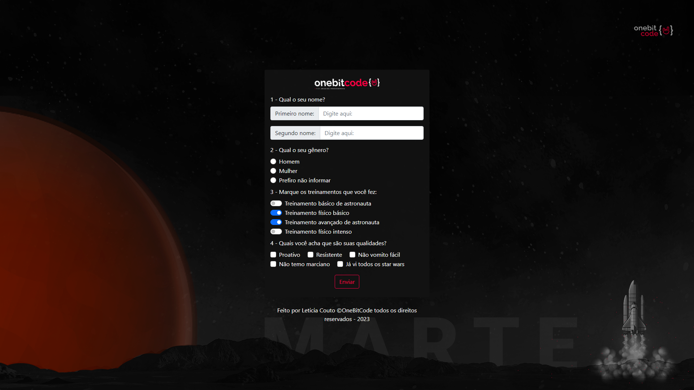

# Landing-Page-Bootstrap
:wink: My first project with Bootstrap /  Meu primeiro projeto com Bootstrap

 

### :mag: My learning
This project was all new to me, it was the first time I made a complete page with Bootstrap. I made it with the knowledge acquired during the OneBitCode course. The code I applied my knowledge and adapted, for example, the background of the image so that it did not have space and white and the centralization of the form.

###  :mag_right: Meu aprendizado
Este projeto foi tudo novo para mim, foi a primeira vez que fiz uma página completa com o Bootstrap. Fiz com os conhecimentos adquiridos durante o curso da OneBitCode. O código apliquei meus conhecimentos e adaptei por exemplo o fundo da imagem para que ele não ficasse com espaço e branco e a centralização do formulário.
